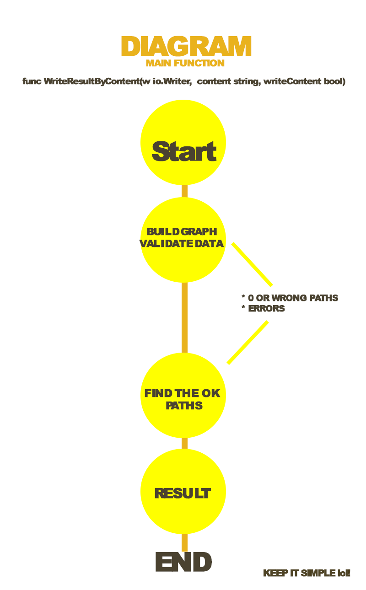

# Usage lem-in

> It takes 1 argument & it can be filename or flag.

# How Program works simple Diagram


----------------------- >

#### Default:
- '"filename"' - your file path with data
#### Flags:
- '--file="filename"' - as default input. Just an explicit launch with a file


Run project:
```bash
cd main
go run main.go (filename | --file=filename)
```
### Examples:
Run program:
$ cd main
$ go run main.go example.txt
#My comment
5
2 5 0
##start
10000000 1 2
##end
crack 9 2
3 5 4
10000000-2
10000000-3
2-10000000
2-crack
L1-2 
L1-crack L2-2 
L2-crack L3-2 
L3-crack L4-2 
L4-crack 
$
```
Also Get Steps Count:
```bash
$ cd main
$ go run main.go example | grep '^L' | wc -l
3
```


Thanks for reading this briefly description.
# HAVE FUN!!!
--the lem-in ant. :)
